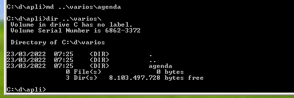
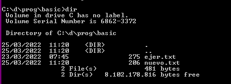

# MSDOS

1

(he usado el equivalente de history doskey /history )

a

2

3

4

5

6

7

8

9

10

11

12

1

archivo visualizado en el bloc de notas

2

3

4

5

6

7

8

9

10

1

2

3

4

5

6

7

8

9

10

1

2

3

4

5

6

7

[https://superuser.com/questions/168336/can-windows-copy-command-handle-multiple-files](https://www.google.com/url?q=https://superuser.com/questions/168336/can-windows-copy-command-handle-multiple-files&sa=D&source=editors&ust=1648410640427593&usg=AOvVaw17ZxxkzZuhiv0L9B4Q3MMy)

8

9

10

